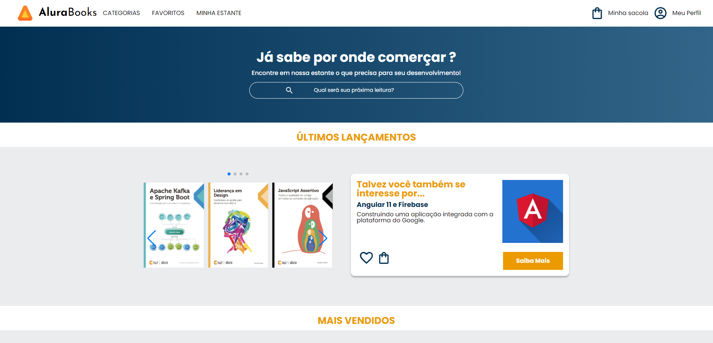

# Alura Books

O Alura Books é um projeto realizado no curso HTML e CSS: responsividade com mobile-first

## ✔️ Técnicas e tecnologias utilizadas

- `HTML`
- `CSS`
- `Swiper JS`

## 📁 Acesso ao projeto

[Veja o projeto final do curso em funcionamento](https://henriquemldev.github.io/alurabooks/).

Neste repositório você tem acesso a todo o material produzido no curso.

## 🛠️ Abrir e rodar o projeto

Para abrir e rodar o projeto, basta abrir o aquivo `index.html` no navegador.

## 📚 Mais informações do curso

Busque na plataforma da Alura o curso **HTML e CSS: responsividade com mobile-first
** publicado na Escola Frontend.
